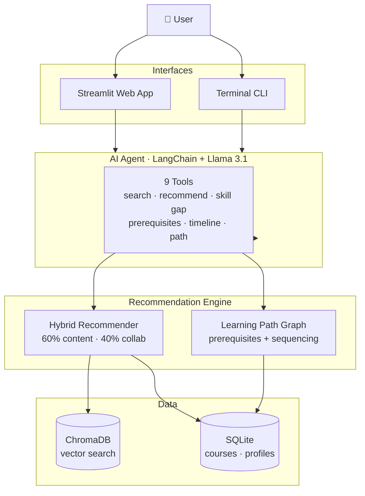

# Course Recommendation System with AI Learning Path Planner

A personal project to build a smart course recommendation system that uses AI agents to help people plan their learning paths. Instead of just showing you random courses, it actually understands your goals and builds a structured learning plan.

## What is this?

I'm building a recommendation system that combines traditional ML algorithms with conversational AI. The main idea is to have an AI agent that acts like a learning advisor — you tell it what you want to learn, and it creates a personalized roadmap with courses in the right order, considering prerequisites and your current skill level.

Think of it as having a really knowledgeable friend who knows thousands of courses and can help you figure out the best path to your goals.

## Why I'm building this

I wanted to work on something that combines:
- Recommendation systems (collaborative filtering, content-based approaches)
- AI agents (using LangChain and local LLMs)
- Real-world application (helping people learn more effectively)

Plus, I'm reading "Principles of Building AI Agents 2nd Edition" and wanted to apply what I'm learning.

## Current Status

**All 7 Phases Complete — CLI + Streamlit web interface, user profiles, personalized timelines, Docker**

- **Phase 1** ✅ — Data pipeline, semantic search, LLM integration (Ollama + llama3.1)
- **Phase 2** ✅ — Content-based, collaborative, and hybrid recommendation engines + Coursera API integration
- **Phase 3** ✅ — Conversational AI agent with 7 tools, conversation memory, CLI chat interface
- **Phase 4** ✅ — Prerequisite chains, intra-level course sequencing, timeline estimation (9 tools total)
- **Phase 5** ✅ — User profile persistence, personalized greetings, smarter timeline defaults
- **Phase 6** ✅ — Streamlit web interface with chat, inline charts, course explorer, profile editor
- **Phase 7** ✅ — Docker Compose setup: one-command deployment, no manual installs

Run with Docker (recommended):
```bash
docker compose up --build
```
Open `http://localhost:8501`

Or run locally:
- Web app: `streamlit run app/streamlit_app.py`
- CLI: `python src/agents/chat_cli.py --user yourname`

---

## Architecture



## Features Built So Far

**AI Agent (Phases 3–5):**
- Chat with a course advisor in natural language
- Automatically selects the right tools (search, recommend, skill gap analysis, timeline, prerequisites, etc.)
- Builds Beginner → Intermediate → Advanced learning paths with per-course hour estimates
- Estimates timeline in weeks based on your available study hours per week
- Shows prerequisite chains so you know exactly what to take before a target course
- Remembers your conversation (last 10 exchanges per session)
- User profiles persisted across sessions in SQLite — skills, goals, and study pace saved automatically
- Personalized greeting on startup for returning users

**Recommendation Engine (Phase 2):**
- Content-based filtering using sentence-transformer embeddings + ChromaDB
- Collaborative filtering (item-item similarity, user-user similarity with synthetic users)
- Hybrid blending (60% content + 40% collaborative) with diversity controls
- Skill gap analysis with foundational-first ordering of missing skills
- Evaluation metrics: Precision@K, Recall@K, NDCG@K, catalog coverage, diversity

**Learning Path Logic (Phase 4):**
- 3,682 prerequisite relationships seeded heuristically across 2,759 courses
- Intra-level topological sequencing using NetworkX (foundational courses before advanced within the same difficulty tier)
- Product-type-aware timeline defaults: Guided Project=2h, Course=20h, Specialization=100h
- Week-by-week study schedule output

**Data Pipeline (Phases 1–2):**
- 2025 Coursera dataset: 3,404 raw → 2,759 unique courses, 1,754 skills
- Coursera OAuth2 API integration for live course data
- SQLite database with course metadata, skills, skill-course links, prerequisites, and user profiles
- ChromaDB vector store for semantic search

## Quick Start

### Option A — Docker (recommended, no installs needed)

Requires [Docker Desktop](https://www.docker.com/products/docker-desktop/).

1. Clone the repo
```bash
git clone https://github.com/tksluangrath/course-recommnedation-agent.git
cd course-recommnedation-agent
```

2. Copy the environment file
```bash
cp .env.template .env
```

3. Start everything
```bash
docker compose up --build
```

The first run downloads Llama 3.1 (~4.7 GB). Subsequent runs start in seconds.
Open `http://localhost:8501` in your browser.

---

### Option B — Manual Setup

#### Prerequisites
- Python 3.9+
- At least 8GB RAM (for running the LLM locally)
- About 10GB free disk space

1. Clone the repo
```bash
git clone https://github.com/tksluangrath/course-recommnedation-agent.git
cd course-recommnedation-agent
```

2. Create a virtual environment
```bash
python -m venv venv
venv\Scripts\activate   # Windows
# source venv/bin/activate  # Mac/Linux
```

3. Install dependencies
```bash
pip install -r requirements.txt
```

4. Install Ollama and download the model
```bash
# Download from https://ollama.com/
ollama pull llama3.1
```

5. Configure environment
```bash
cp .env.template .env
# Edit .env — set COURSERA_CLIENT_ID and COURSERA_CLIENT_SECRET if you have API access
```

6. Get the course data

Download the 2025 Coursera dataset from Kaggle and place it in `data/raw/`:
```
data/raw/coursera_courses_2025.csv
```

7. Initialize the pipeline
```bash
python src/utils/data_cleaner.py
python src/utils/database.py
python src/utils/load_data_to_db.py
python src/utils/embeddings.py
```

8. Start the app
```bash
streamlit run app/streamlit_app.py
# or CLI:
python src/agents/chat_cli.py --user yourname
```

### Example Agent Session

```
$ python src/agents/chat_cli.py --user alice

Welcome back, alice!
  Goal       : become a data scientist
  Skills     : Python, SQL
  Study time : 8 hrs/week

You: Create a learning path. I already know Python and SQL.

Advisor: Great foundation! Here's your personalized learning path:

  Beginner (~160 hrs):
  • Applied Data Science (IBM) — ~20 hrs
  • Data Science Fundamentals (UC Irvine) — ~20 hrs
  • Data Literacy (Johns Hopkins) — ~120 hrs

  Intermediate (~200 hrs):
  • Applied Data Science with Python (University of Michigan) — ~20 hrs
  • Data Science at Scale (University of Washington) — ~80 hrs
  • Data Structures and Algorithms (UCSD) — ~100 hrs

  Advanced (~240 hrs):
  • Google Advanced Data Analytics — ~20 hrs
  • Google Business Intelligence — ~20 hrs
  • Data Warehousing for Business Intelligence — ~200 hrs

  --- Timeline (8 hrs/week) ---
  Total: ~600 hrs (~75 weeks)
  Weeks 1–20: Beginner (3 courses, ~160 hrs)
  Weeks 21–45: Intermediate (3 courses, ~200 hrs)
  Weeks 46–75: Advanced (3 courses, ~240 hrs)
```

### Profile Commands

Once you're in the chat:
```
/profile          — show your saved profile
/skills Python, SQL, R  — add skills to your profile
/goal become a data scientist  — set your learning goal
/hours 8          — set available study hours per week
/reset            — clear conversation history
/history          — show conversation history
/quit             — save and exit
```

## Quick Examples

**Chat with the agent programmatically:**
```python
import torch  # must be first on Windows + Python 3.13
from src.agents.course_advisor import CourseAdvisorAgent

agent = CourseAdvisorAgent(user_id="alice")
response = agent.chat("What skills should I learn for machine learning?")
print(response)
```

**Use the recommendation engine directly:**
```python
import torch
from src.recommender.hybrid import HybridRecommender

rec = HybridRecommender()
results = rec.recommend("machine learning for beginners", n=5)
print(results[['course_name', 'difficulty_level', 'hybrid_score']])
```

**Semantic search:**
```python
import torch
from src.utils.embeddings import EmbeddingManager

em = EmbeddingManager()
results = em.search_courses("deep learning with PyTorch", n_results=5)
print(results[['course_name', 'difficulty_level']])
```

## Project Structure

```
course-recommnedation-agent/
├── app/
│   └── streamlit_app.py        # Streamlit web UI (Phase 6)
│
├── data/
│   ├── raw/                    # Downloaded datasets
│   ├── processed/              # Cleaned data
│   └── embeddings/             # ChromaDB vector store
│
├── src/
│   ├── agents/
│   │   ├── course_advisor.py   # CourseAdvisorAgent (LangChain v1.2)
│   │   └── chat_cli.py         # Terminal chat interface with profile commands
│   ├── recommender/
│   │   ├── content_based.py    # Embedding-based recommender
│   │   ├── collaborative.py    # Item-item & user-user filtering
│   │   ├── hybrid.py           # 60/40 blended recommender
│   │   ├── evaluator.py        # Precision/Recall/NDCG metrics
│   │   └── path_graph.py       # Prerequisite chains, sequencing, timeline
│   ├── tools/
│   │   └── recommender_tools.py  # 9 LangChain @tool functions
│   └── utils/
│       ├── data_cleaner.py     # 2025 dataset cleaning + sample data generation
│       ├── database.py         # SQLite ORM (SQLAlchemy) + ProfileManager
│       ├── embeddings.py       # ChromaDB + sentence-transformers
│       ├── llm_config.py       # Ollama / Anthropic LLM setup
│       ├── load_data_to_db.py  # ETL: cleaned CSV → SQLite + skill links
│       ├── api_collectors.py   # CourseraAPI (OAuth2) + edX + YouTube collectors
│       └── api_config.py       # API credential config + APICollector
│
├── fetch_coursera_data.py      # Download Kaggle dataset via kagglehub
├── Dockerfile                  # Python 3.11-slim app image (Phase 7)
├── docker-compose.yml          # Orchestrates app + ollama containers (Phase 7)
├── docker-entrypoint.sh        # Pulls model on first run, starts Streamlit (Phase 7)
├── INSTRUCTIONS.md             # Full setup and usage guide
├── docs/
│   └── PHASE1_COMPLETE.md … PHASE7_COMPLETE.md
└── requirements.txt
```

## Agent Tools

The agent has 9 tools it can call autonomously:

| Tool | What it does |
|---|---|
| `search_courses` | Natural language course search |
| `find_similar_courses` | Find courses similar to a given one |
| `recommend_by_skills` | Recommend by target skill list |
| `create_learning_path` | Build Beginner → Advanced roadmap with timeline |
| `analyze_skill_gap` | Find missing skills in foundational-first order |
| `get_course_info` | Detailed info about a specific course |
| `get_popular_skills` | Trending skills by category |
| `estimate_learning_timeline` | Estimate weeks to complete a topic given hrs/week |
| `get_prerequisite_path` | Show the prerequisite chain for a specific course |

## Tech Stack

- **Python** — everything
- **LangChain v1.2** — agent framework (`create_agent` API)
- **Ollama + Llama 3.1** — local LLM inference, no API costs
- **langchain-ollama** — ChatOllama for tool-calling support
- **ChromaDB** — vector database for semantic search
- **sentence-transformers** (`all-MiniLM-L6-v2`) — course embeddings
- **SQLite + SQLAlchemy** — course metadata, prerequisites, and user profiles
- **NetworkX** — prerequisite graph, topological sequencing
- **Coursera OAuth2 API** — live course data
- **Streamlit + Plotly** — web interface with inline charts (Phase 6)
- **Docker + Docker Compose** — containerized deployment (Phase 7)

## Roadmap

**Phase 1: Foundation** ✅
- Project setup, data pipeline, semantic search, LLM integration
- See [PHASE1_COMPLETE.md](docs/PHASE1_COMPLETE.md)

**Phase 2: Recommendation Algorithms** ✅
- Content-based filtering, collaborative filtering, hybrid blending
- Evaluation metrics, Coursera API integration
- See [PHASE2_COMPLETE.md](docs/PHASE2_COMPLETE.md)

**Phase 3: AI Agent** ✅
- LangChain agent with 7 tools, conversation memory, CLI interface
- See [PHASE3_COMPLETE.md](docs/PHASE3_COMPLETE.md)

**Phase 4: Learning Path Logic** ✅
- Prerequisite chains (3,682 relationships), intra-level course sequencing
- Timeline estimation with week-by-week schedule
- See [PHASE4_COMPLETE.md](docs/PHASE4_COMPLETE.md)

**Phase 5: User Profiles & Smarter Timelines** ✅
- User profiles persisted in SQLite across sessions
- Profile context injected into every agent conversation turn automatically
- Product-type-aware timeline defaults (Guided Project=2h, Course=20h, Specialization=100h)
- See [PHASE5_COMPLETE.md](docs/PHASE5_COMPLETE.md)

**Phase 6: Web Interface** ✅
- Streamlit chat UI with dark theme and teal accents
- Inline Plotly charts (Gantt timeline + skill gap donut)
- Profile editor, quick action forms, filterable course explorer
- See [PHASE6_COMPLETE.md](docs/PHASE6_COMPLETE.md)

**Phase 7: Docker** ✅
- Docker Compose setup: `app` container (Python/Streamlit) + `ollama` container
- Model pulled automatically on first run, cached in named volume
- Existing `data/` mounted as volume — no re-loading needed
- See [PHASE7_COMPLETE.md](docs/PHASE7_COMPLETE.md)

## Known Issues

- **PyTorch DLL Loading (Windows + Python 3.13):** Scripts importing sentence-transformers must have `import torch` as the very first import. The CLI chat handles this automatically.
- **First query latency:** The first query initializes the embedding model, ChromaDB, and synthetic user data — this takes ~10–20 seconds. Subsequent queries are fast.
- **Timeline hours can be large:** The dataset includes Specializations (multi-course bundles) which report 100+ estimated hours. The product-type defaults (Phase 5) mitigate this for courses with missing data, but Specializations with known hours still contribute their full length.
- **Cross-category prerequisites:** The heuristic prerequisite seeder only links courses within the same category. Cross-category dependencies (e.g., "Statistics before Machine Learning") are not captured.

## About the Data

Using the Coursera 2025 dataset from Kaggle:
- 3,404 raw → 2,759 unique courses after deduplication
- 1,754 unique skills extracted from `Gained Skills` field
- 38,204 skill-course links
- 3,682 prerequisite relationships (heuristically seeded)
- Top skills: data analysis (446 courses), machine learning (310), Python (287), data science (241), SQL (198)

Also supports live data from the Coursera API (OAuth2 client credentials) which provides real course descriptions.

## Contributing

This is a learning project, but suggestions, issues, and PRs are welcome. I'm figuring things out as I go.

## Notes

- Running everything locally to avoid API costs
- Learning about both recommendation systems and AI agents simultaneously

## License

MIT License — use it however you want

## Links

- [LangChain docs](https://python.langchain.com/)
- [Ollama](https://ollama.com/)
- [Dataset (Kaggle — 2025)](https://www.kaggle.com/datasets/yosefxx590/coursera-courses-and-skills-dataset-2025)

---

Last updated: February 2026
Status: All 7 phases complete
